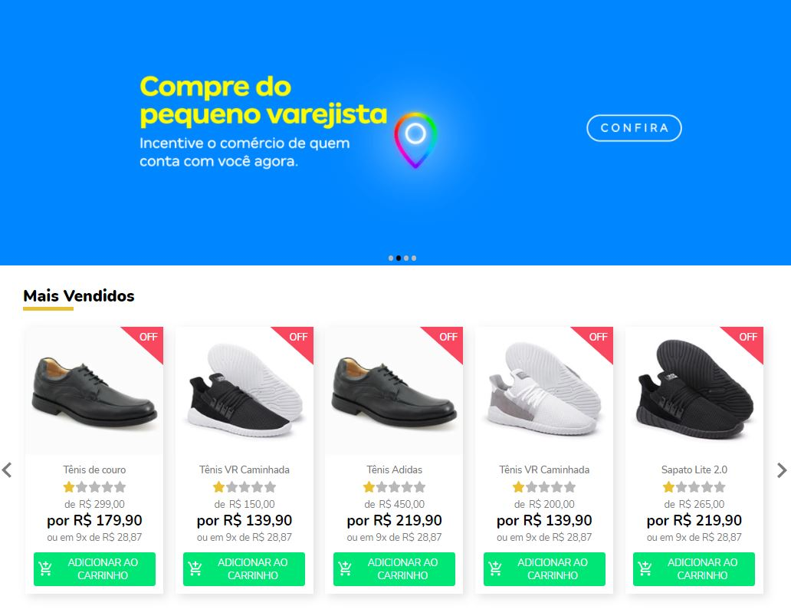

# GoBeyond Shop

<h1 align="center">
    
</h1>

### O desafio

Fazer o layout da loja e implementar algumas funcionalidades.

## 🧬 Technologies

This project was developed using the following technologies:
- [React](https://reactjs.org)
- [TypeScript](https://www.typescriptlang.org/)
- [Sass](https://sass-lang.com/)
- [Yup](https://www.npmjs.com/package/yup?activeTab=readme)
- [Formik](https://formik.org/)

## 🚀 Getting started

Clone the project and access the folder

```bash
$ git clone https://github.com/evertonvargas/GoBeyond-shop.git

```

Follow the steps below
```bash
# Install the dependencies
$ npm i or yarn

# Start the project
$ yarn dev or npm run dev
```

